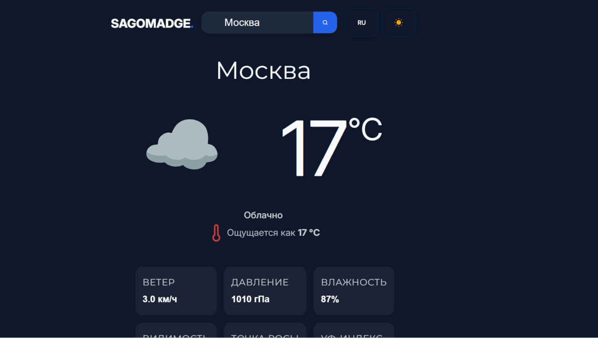
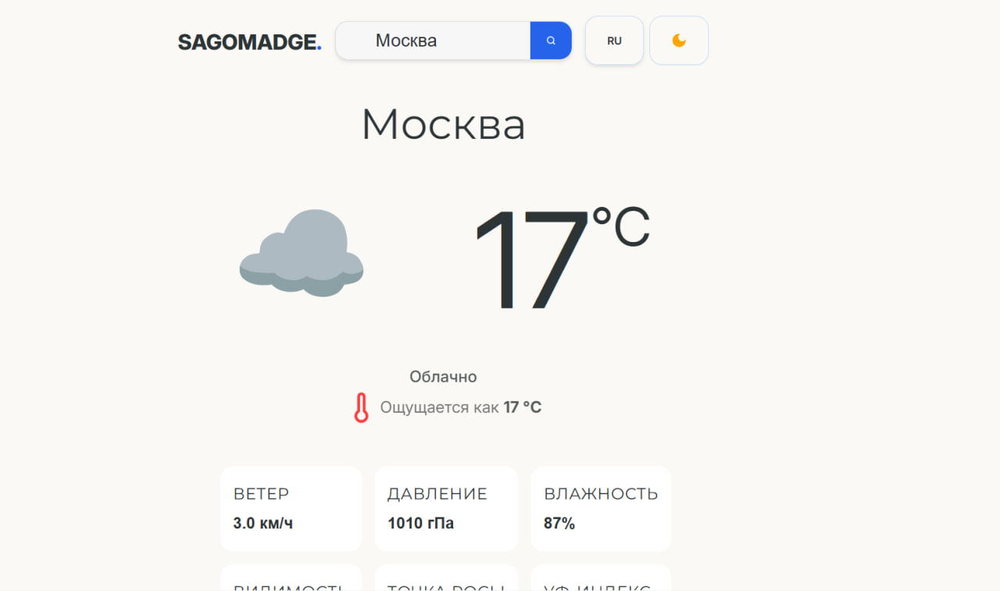
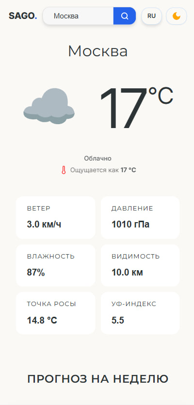

# ⛅ SagoWeather

Погодное приложение с текущей погодой и прогнозом на 7 дней. Поиск по городу, смена темы и языка.

**[→ Живое демо](http://weather-app-react-zy8p.vercel.app)**

---



---

## Что умеет приложение

- Текущая погода по любому городу: температура, ощущаемая, ветер, давление, влажность, видимость, точка росы, УФ-индекс
- Прогноз на 7 дней с иконками погодных условий
- Смена иконки день/ночь — луна появляется если текущее время после заката или до рассвета
- Переключение языка RU/EN
- Тёмная и светлая тема
- Валидация поиска — город не может содержать цифры
- Кнопка "Повторить" при ошибке сети
- Адаптив от 250px до 1440px+

---



---

## Технические решения

**Два параллельных API**
Приложение делает два запроса к разным источникам: OpenWeatherMap для текущей погоды и Open-Meteo для недельного прогноза. Координаты из первого ответа передаются в URL второго запроса.

**Слой трансформации данных**
Сырые ответы API сразу маппируются в типизированные объекты — `mapCurrentWeather` и `mapForecastData`. `App` никогда не работает с сырыми данными, только с готовыми `MappedWeather` и `ForecastDay[]`.

**Типизированные ошибки**
`WeatherError extends Error` с полем `code` — приложение различает `CITY_NOT_FOUND` и `NETWORK_ERROR` и показывает разные сообщения.

**Ручная i18n**
Переводы изолированы в `translations.ts` как `as const` объект. `Translations` тип выводится автоматически через `typeof translations`. Нет внешних зависимостей.

**WMO коды прогноза**
Open-Meteo возвращает числовые коды погоды по стандарту WMO. `interpretWmoCode` маппит их в типизированный `Conditions` union — те же иконки что и для текущей погоды.

---



---

## Стек

|                       |                      |
| --------------------- | -------------------- |
| React 19 + TypeScript | UI и типизация       |
| Vite                  | Сборка               |
| OpenWeatherMap API    | Текущая погода       |
| Open-Meteo API        | Прогноз на 7 дней    |
| Intl.DateTimeFormat   | Локализация дат      |
| Lucide React          | Иконка термометра    |
| CSS Custom Properties | Дизайн-система, темы |

---

## Запуск локально

```bash
git clone https://github.com/SAGOMADGE/WEATHER-APP-REACT
cd WEATHER-APP-REACT
npm install
```

Создай `.env` файл:

```
VITE_WEATHER_API_KEY=твой_ключ_от_openweathermap
```

```bash
npm run dev
```

Ключ можно получить бесплатно на [openweathermap.org](https://openweathermap.org/api)


## Код-ревью и доработки

Проект прошёл код-ревью у практикующего senior-разработчика. По итогам внесены правки:

**Два источника правды в поиске.** Локальный стейт инпута синхронизировался с пропсом `city` через `useEffect` — антипаттерн, создающий риск рассинхрона и потенциальных циклов при дальнейшем расширении логики (например, автокомплита). Заменил на `key={city}` в родительском компоненте: при смене города React полностью размонтирует и заново монтирует `SearchBar`, инпут получает актуальное значение через чистую инициализацию `useState(city ?? "")` — без ручной синхронизации.

**Персистентность состояния.** Город, язык и тема сбрасывались при обновлении страницы. Написал типизированный хук `useLocalStorage<T>` с ленивой инициализацией (читает LocalStorage один раз при монтировании через функцию в `useState`) и try/catch на случай недоступности хранилища (приватный режим браузера).

**Мигание интерфейса при смене языка.** Индикатор загрузки был завязан напрямую на `isLoading`, поэтому при смене языка (хотя данные о городе физически те же) старый контент пропадал, показывался лоадер, контент появлялся заново. Изменил условие рендера: лоадер показывается только если данных ещё нет вообще (`isLoading && !weather`), иначе старые данные остаются на экране пока грузятся новые.

**Runtime-валидация API.**
Внешние данные больше не типизируются через `as RawResponse`. Ответы API сначала рассматриваются как `unknown`, затем проходят через user-defined type guards. Это обеспечивает runtime-проверку структуры ответа и защищает приложение от изменений контракта API.
